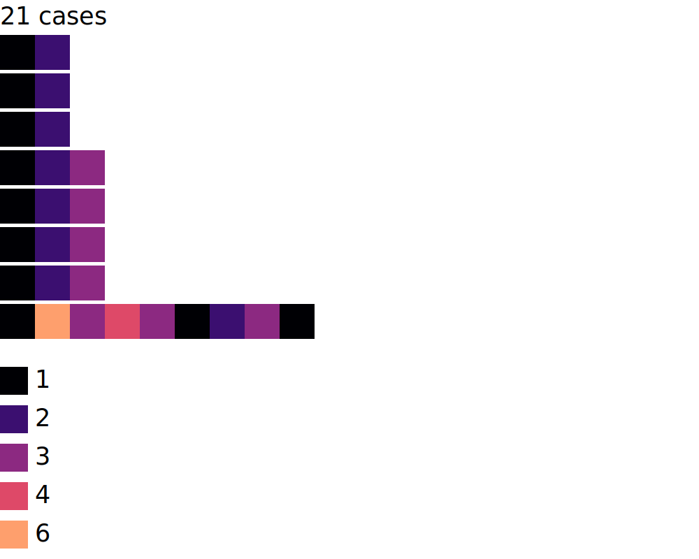

# visuEL
visuEL is a Python library for sampling and visualizing event logs (from process mining) quickly and concisely.

## Installation
Use the package manager [pip](https://pip.pypa.io/en/stable/) to install foobar.

```bash
pip3 install visuEL
```

## Usage
Below we present a minimal working example to use the library. Check the [tuto](tuto.md) for advanced usage (i.e., clustering visualization).
```python
from visuEL import Vis
from visuEL import CminSampler

# The event logs is represented as a list of lists 
eventLogs = [[1,2,3],[1,2,3],[1,2,3],[1,2,3],[1,2,3],[1,2,3],[1,2,3],[1,2,3],[1,2],[1,2],[1,2],[1,2],[1,2],[1,2],[1,2,3],[1,2,3],[1,4,3],[1,6,3,4,3,1,2,3,1],[1,6,3,4,3,1,2,3,1],[1,6,3,4,3,1,2,3,1],[1,6,3,4,3,1,2,3,1]] # 21 traces

# Step1: Sampling
# Event logs are often composed of thousands of traces (information overload if we show all of them).
# Hence, we show only representative traces (select by the CminSampler algorithm, described here: xxx)
# We automatically select the number of representatives to show using the following scale: 
#   100 traces : 11 representatives
#   3K traces : 20 representatives
#   100K traces : 28 representatives
#   100M traces : 40 representatives
sampler = CminSampler()
sampler.load_from_seq(eventLogs)
sampled_el = sampler.sample()

# sampled_seq contains the 8 traces that best summarize the 21 traces
# [[1, 2], [1, 2], [1, 2], [1, 2, 3], [1, 2, 3], [1, 2, 3], [1, 2, 3], [1, 6, 3, 4, 3, 1, 2, 3, 1]] # 8 traces

# Now, we can create an SVG visualization using the following code
# (we suggest showing the number of original cases as a title of the visualization)
title = '{} cases'.format(len(eventLogs))
vis = Vis(title=title)
vis.load_from_seq(eventLogs)


# Will export the result as SVG
# Instead of 'seqlegend', we can export only the 'legend' or the 'seq' 
vis.save_svg('seqlegend', 'test_seqlegend.svg')
```

The output SVG looks like:


## Format
Instead of loading an event log from a sequence, the sampler and the visualizer can load pm4py object, dataframe, and xes files (see below)
```python
from visuEL import Vis
from visuEL import CminSampler

sampler = CminSampler()
sampler.load_from_xes('path_to_xes_file')
#sampler.load_from_pm4py(log_loaded_with_pm4py)
#sampler.load_from_df(dataframe, 'case_col', 'activity_col')
sampled_el = sampler.sample()

vis = Vis()
vis.load_from_xes('path_to_xes_file')
#vis.load_from_pm4py(log_loaded_with_pm4py)
#vis.load_from_df(dataframe, 'case_col', 'activity_col')
```

## Online
We also propose a [web-based tool](http://visuel.customer-journey.me) that transforms an event log into an SVG online.

## Contact
Please do not hesitate to contact me at visuel_contact@pm.me
