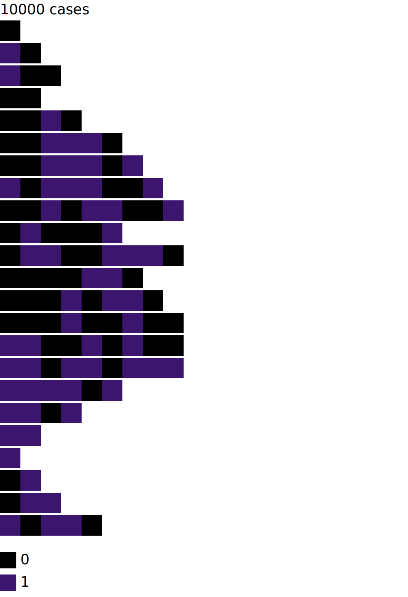

# visuEL
visuEL is a Python library for sampling and visualizing event logs (from process mining) in a fast and concise way.

## Installation
Use the package manager [pip](https://pip.pypa.io/en/stable/) to install foobar.

```bash
pip3 install visuEL
```

## Usage
```python
from visuEL import Vis
from visuEL import CminSampler

# The event logs is represented as a list of list
eventLogs = [[1,2,3],[1,2,3],[1,2,3],[1,2,3],[1,2,3],[1,2,3],[1,2,3],[1,2,3],[1,2],[1,2],[1,2],[1,2],[1,2],[1,2],[1,2,3],[1,2,3],[1,4,3],[1,6,3,4,3,1,2,3,1],[1,6,3,4,3,1,2,3,1],[1,6,3,4,3,1,2,3,1],[1,6,3,4,3,1,2,3,1]] # 21 traces

# Step1: Sampling
# Event logs are often composed of thousands of traces (information overload if we show all of them).
# Hence, we show only representative traces (select by the CminSampler algorithm, described here: xxx)
# We automatically select the number of representatives to show using the following scale: 
#   100 traces : 11 representatives
#   3K traces : 20 representatives
#   100K traces : 28 representatives
#   100M traces : 40 representatives
sampler = CminSampler(eventLogs)
sampled_el = sampler.sample()

# sampled_seq contains the 8 traces that best summarize the 21 traces
# [[1, 2], [1, 2], [1, 2], [1, 2, 3], [1, 2, 3], [1, 2, 3], [1, 2, 3], [1, 6, 3, 4, 3, 1, 2, 3, 1]] # 8 traces

# Now we can create a SVG visualization using the following code
# (we suggest showing the number of original cases as a title of the visuaization)
title = '{} cases'.format(len(eventLogs))
vis = Vis(sampled_el, title=title)

# Will export the result as svg
# Instead of 'seqlegend', we can export only the 'legend' or the 'seq' 
vis.save_svg('seqlegend', 'test_seqlegend.svg')
```

The output SVG look like:


## Contact
Please do not hesitate to contact me at visuel_contact@pm.me
